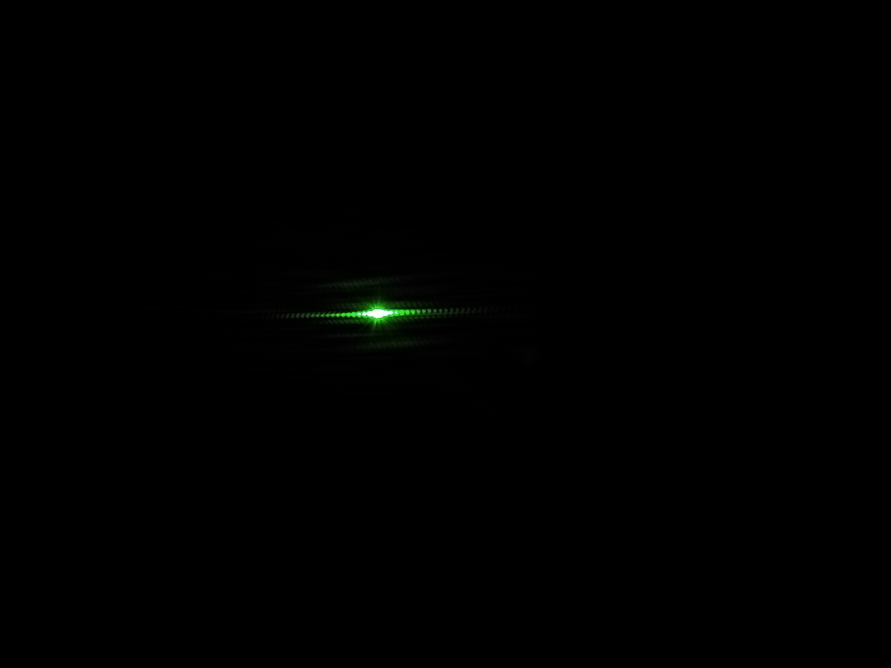

### Calculadora de numeros complejos

En este repositorio encontrara una libreria hecha en java donde su función es actuar como calculadora de números complejos

### Requisitos de uso

Para utilizar dicha libreria se debe tener instalado algún IDE (Netbeans, Eclipse etc), además de contar con los archivos que se encuentran en este repositorio

### Instalación 

Para instalar y ejecutar esta libreria lo que debe hacer es ejecutar algún IDE  y desde ahí abrir los archivos para ejecutarlo.

### Utilidades: Basado en el libro Quantum Computing for Computing Scientists se cuenta con las siguientes funciones.

    Capítulos 1 y 2:
    - Suma de complejos y matrices
    - Resta de complejos y matrices 
    - Conjugado de un complejo y una matriz
    - Inverso de un complejo y una matriz 
    - Producto entre complejos, complejo - matriz y entre matrices
    - Division entre complejos y matrices
    - Modulo de un complejo y matriz
    - Fase de un complejo
    - Adjunta de una matriz
    - Traspuesta de una matriz
    - Producto Interno
    - Producto Tensor
    
    Capítulo 3:
    - Experimento de las canicas con una Matriz Binaria
    - Experimento de las canicas con Pesos
    - Experimento de las canicas con coeficientes complejos
    - Experimento de la doble rendija
    
    Capítulo 4:
    - El sistema calcula la probabilidad de encontrarlo en una posición en particular.
    - El sistema si se le da otro vector Ket busca la probabilidad de transitar del primer vector al segundo.
    - Ahora con una matriz que describa un observable y un vector ket, el sistema revisa que la matriz sea hermitiana, 
      y si lo es, calcula la media y la varianza del observable en el estado dado.
    - El sistema calcula los valores propios del observable y la probabilidad de que el sistema transite a alguno de los vectores propios después de la observación.

##  Experimento de las multiples rendijas
    
Este repositorio cuenta además con el experimento de Young (doble rendija), el cual puedes ver descargardo el archivo zip que adjuntamos
junto a mi compañero Carlos Manuel Murillo [Camu10](https://github.com/Camu10/CNYT)

 
## Experimento de la Roble Rendija

### Explicacion teorica
Cuando estas particulas llegan a la doble rendija, cada una de estas rendijas actuará como un foco emisor secundiaro. Por lo tanto se crearán dos ondas que interferirán. 
Por esto podemos observar regiones con mucha intensidad (interferencia constructiva de la ondas) y otras regiones con poca intensidad (interferencia destructiva de las ondas).Esto es lo que llamamos patrón de interferencia.
Lo primero que vemos es que los electrones llegan a la pantalla y colisionan con ella en regiones localizadas. Esto nos lleva a pensar que se comportan como electrones. Si dejamos que el experimento avance, conforme se van acumulando tales colisiones vemos algo asomboroso. Se comienza a formar un patrón de franjas con áreas de mucha intensidad y areas de poca intensidad. 
Estamos recostruyendo un patrón de interferencias. Parece lógico que el electrón, cuando ha estado en vuelo desde las rendijas hasta la pantalla, se ha comportado como una onda.

### Procedimiento
En este experimento utilizamos un láser y un trozo de papel aluminio pegado a una octavo de papel cartón con dos cortes horizontales en el papel muy pegados entre sí. Apuntamos el laser a el medio de los dos cortes del papel aluminio logrando así que la luz del láser pase a través de los dos cortes, lo que produce que las ondas de luz que atraviesan estos dos cortes produzcan una interferencia entre si , 
logrando una distorsión y generando así el patrón de luz que podemos observar.

Como podemos ver en la imagen la luz del lazer se distorciona en varios puntos generando asi este patron.

## Construido con

* Java Version 8 Update 201 Usado para desarrollar la libreria.

## Autores ✒️

* **Cesar Gonzalez**
